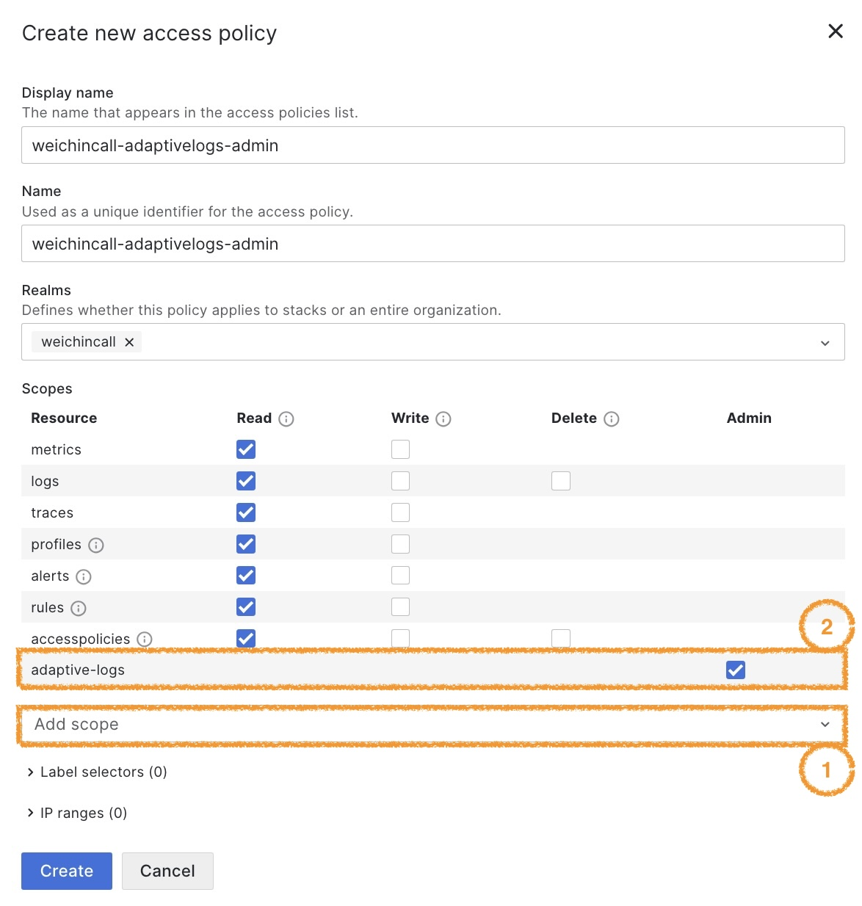

# grafana-adaptivelogs-export-recommendations
Extract recommendations json from Grafana Adaptive Logs Recommendations API endpoint and convert to CSV for easy import into Google Sheets for further analysis.

## Run Locally

Clone the project

```bash
  git clone https://github.com/wcall/grafana-adaptivelogs-export-recommendations
```

Go to the project directory

```bash
  cd grafana-adaptivelogs-export-recommendations
```

Reference the provided dummy_environment_authcredentials.csv to create your own environment_authcredentials.csv

Navigate to grafana.com Cloud Portal, click your account to log in and lookup the userid and the regional URL values associated with your slug-logs Grafana Cloud Logs backend. 

Reference https://grafana.com/docs/grafana-cloud/security-and-account-management/authentication-and-permissions/access-policies/create-access-policies/ for steps on how to create an access policy. You need to add the `adaptive-logs:admin` scope before generating a token. 



Run any variation of these commands to extract the Adaptive Logs Recommendations JSON outputs and convert them into CSV format. 

```bash
  ./adaptivelogs-export.sh environment-authcredentials.csv 

  ./adaptivelogs-export.sh environment-authcredentials.csv 0.65

  ./adaptivelogs-export.sh environment-authcredentials.csv <yourCombinedPricePerGBForIngestAndRetention> <yourSlugName>-logs
```

## Authors
- [@wcall](https://www.github.com/wcall)